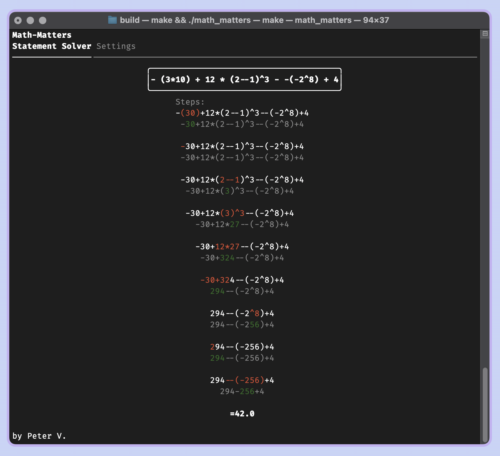

# Math Matters
A project dealing in _matters mathematical_.



## Build
This project uses [CMake](https://cmake.org/) to simplify the build process. To build the project, run the following 
commands:
```bash
    mkdir build
    cd build
    cmake ..
    make
```
### Targets
The following targets are available:
* `math_matters` - The main executable.
* `tests` - The test executable.

#### Build Note:
Because I used fetch_content to include all dependencies, you will need to have internet access to build the project,
and it will probably take a **while** (just under 5 min. for me) to download all the dependencies and build them. I 
would recommend chaining
the build commands together and watching a movie or something while you wait.


### Dependencies
This project depends on the following libraries:
* [Catch2](https://github.com/catchorg/Catch2) - A modern, C++-native, header-only, test framework for unit-tests, TDD and BDD.
* [FTXUI](https://github.com/ArthurSonzogni/FTXUI) - A C++ library to build terminal user interfaces.
* [Boost](https://www.boost.org/) - A collection of C++ libraries.
* [spdlog](https://github.com/gabime/spdlog) - Fast C++ logging library.


## Usage
### Math Matters
Within the main executable, users can enter a mathematical expression in infix notation and have it evaluated.
At the moment, only integer values are supported.

Valid operators include:
* `+` - Addition
* `-` - Subtraction (AND unary negation)
* `*` - Multiplication
* `/` - Division
* `^` - Exponentiation

You may also use parentheses to group expressions.
For example, -(42*41) + 2 + 4 * 2/(1-5)+42^2 would evaluate to 42.
_Note that very small numbers may be rounded to 0._
Input validation is _okay_.

### Tests
The test executable is used to run unit tests for the project.
At the moment, 93% of the code is covered by unit tests.

## Process
The project only had to evaluate valid integer expressions in infix notation including unary negation.
I decided to expand the scope by including input parsing and displaying steps for the evaluation process.
### Implementation Notes
#### Input Parsing
If I wanted to improve this project, I would consolidate input parsing in a better way. Currently, the input is parsed
with a variety of methods including some basic loops and checking, and regular expressions. However in my defense,
I did not know much about the `std::regex` library until after I had already written most of the input parsing code,
and then when I began adding necessary modifications for missed cases, I realized the limitations of `std::regex` and
switched to `boost::regex` instead. I wish I had just used boost from the start; using regex for all the parsing would
have been much cleaner and easier to maintain.
#### Displaying Steps
This was mostly an afterthought which I implemented perhaps too hastily with the goal of just getting it working. 
Making the steps display is a bit of a hack, currently working something like this:
1. On every input change, the expression is attempted to be parsed/evaluated.
2. If the expression is valid, it is evaluated and during the evaluation step, we basically scan the expression string
   and replace each token with the corresponding value from the evaluation stack.
   1. The resulting string is re-parsed (to replace special operator symbols that are unique to my program) and saved 
      as a step in a vector of strings.

This was alright, but then I thought it would be cool to have the steps display in a more descriptive way, sorta like 
[Symbolab](https://www.symbolab.com/solver/step-by-step/32%2B4x%3D-13?or=input) and similar sites.
1. When rendering the list of steps in the UI, we iterate through the vector of steps and render each one.
   1. To highlight the operation happening in the current step, we look at the next step, and basically slice the 
      difference between them. Once they are sliced we can color the operation in the current step quite easily.
   2. To highlight the result in the _sorta 'sub-set'_, we have to do some more jerry-rigging but with a little bit of 
      perseverance, it works out quite well (though not perfect when step-strings match each other in certain ways).
   
#### UI
FTXUI has proved to be super simple to use and I really like it. I think my only gripe is that there often doesn't 
appear to be a 'right' way to do things. For example, I feel like I tried 10 different ways to conditionally render
UI components. 

#### Logging
Working with UI's I've quickly come to terms with how inconvenient (or often impossible) it is to have to `std::cout` 
debug messages. I've been acclimating to using the built in debugger in my IDE (to great success) and messing around 
with logging via spdlog which has been a great experience.